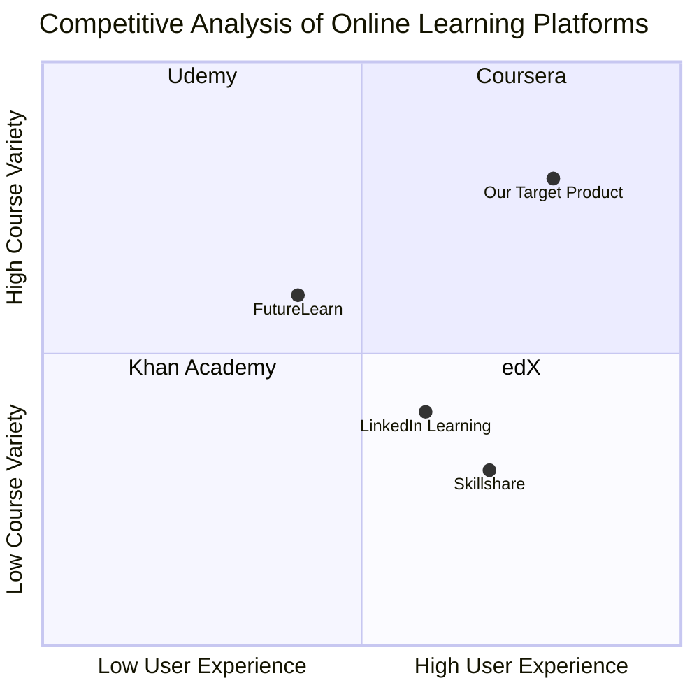

## Original Requirements
The boss wants an advanced online learning platform that prioritizes user interface (UI) and user experience (UX), efficient workflows, technology integration, and seamless navigation. The platform should enable users to create, explore, and engage with educational content effortlessly. The platform's UI/UX should be user-friendly, with an appealing homepage layout and a clear navigation bar. The platform should feature Learning Paths, Courses, and Profile sections. The Course Creation interface should streamline course development with drag-and-drop features, a WYSIWYG editor, and automatic and manual tile linking. The platform should use cutting-edge technologies like Flask, HTML5, CSS3, and JavaScript, and should be responsive across various devices. The platform should also have seamless linkages between tabs and interactions.

## Product Goals
```python
[
    "Develop an advanced online learning platform with a user-friendly UI/UX",
    "Implement efficient workflows and seamless navigation for a smooth user experience",
    "Integrate cutting-edge technologies for robust and responsive performance"
]
```

## User Stories
```python
[
    "As a user, I want to easily navigate the platform so that I can find the courses I am interested in",
    "As a user, I want to create my own courses using a simple and intuitive interface",
    "As a user, I want to track my progress and see my completed courses and quizzes in my profile",
    "As a user, I want to explore different learning paths and engage with the content effortlessly",
    "As a user, I want the platform to be responsive across various devices so I can learn on the go"
]
```

## Competitive Analysis
```python
[
    "Coursera: Offers a wide range of courses but lacks a user-friendly course creation interface",
    "Udemy: Allows users to create and sell courses, but the platform is not very intuitive",
    "Khan Academy: Provides a great learning experience but lacks advanced course creation features",
    "edX: Offers high-quality courses but the user interface is not very appealing",
    "LinkedIn Learning: Great for professional development but lacks a diverse range of courses",
    "Skillshare: Offers creative courses but lacks in-depth academic content",
    "FutureLearn: Provides university-level courses but the platform is not very responsive across devices"
]
```

## Competitive Quadrant Chart


## Requirement Analysis
The product should be an online learning platform with a user-friendly UI/UX, efficient workflows, and seamless navigation. It should allow users to create, explore, and engage with educational content effortlessly. The platform should integrate cutting-edge technologies and be responsive across various devices.

## Requirement Pool
```python
[
    ("Develop a user-friendly UI/UX for the platform", "P0"),
    ("Implement efficient workflows and seamless navigation", "P0"),
    ("Integrate a course creation interface with drag-and-drop features", "P1"),
    ("Incorporate cutting-edge technologies for robust performance", "P1"),
    ("Ensure the platform is responsive across various devices", "P2")
]
```

## UI Design draft
The platform will have a clean and minimalist design with a focus on usability. The homepage will feature a navigation bar at the top with links to Learning Paths, Courses, and Profile. Each Learning Path will be represented by a visually appealing card with a title, description, and image. The Course Creation interface will be intuitive, with drag-and-drop features for adding content and quizzes. The platform will be responsive, ensuring a consistent user experience across various devices.

## Anything UNCLEAR
There are no unclear points.