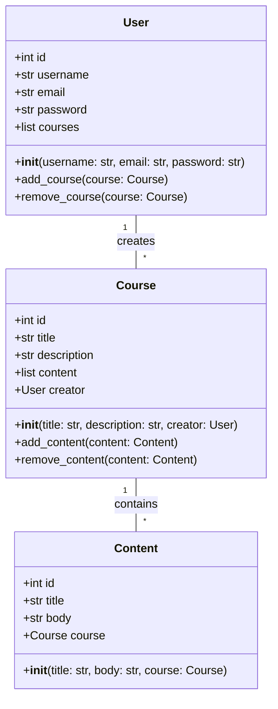
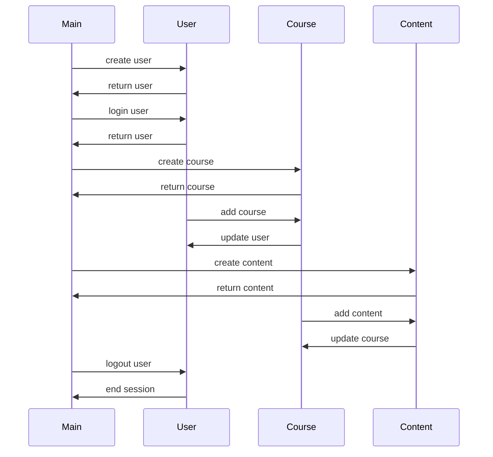

## Implementation approach
We will use Flask for the backend, which is a lightweight and powerful Python web framework. For the frontend, we will use HTML5, CSS3, and JavaScript. For the course creation interface, we will use a WYSIWYG editor like CKEditor, which is an open-source rich text editor. We will also use jQuery UI for the drag-and-drop features. For the database, we will use SQLAlchemy, which is a SQL toolkit and ORM for Python. We will use Bootstrap for responsive design. The difficult points will be the integration of these technologies and ensuring a smooth user experience.

## Python package name
```python
"online_learning_platform"
```

## File list
```python
[
    "main.py",
    "config.py",
    "models.py",
    "views.py",
    "templates/index.html",
    "templates/course.html",
    "templates/profile.html",
    "static/css/main.css",
    "static/js/main.js"
]
```

## Data structures and interface definitions


## Program call flow


## Anything UNCLEAR
The requirement is clear to me.